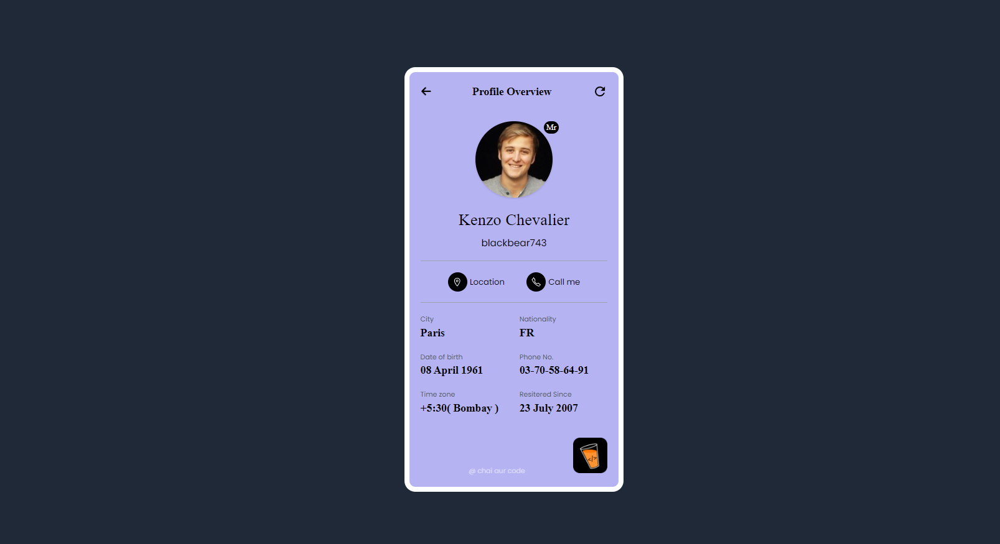
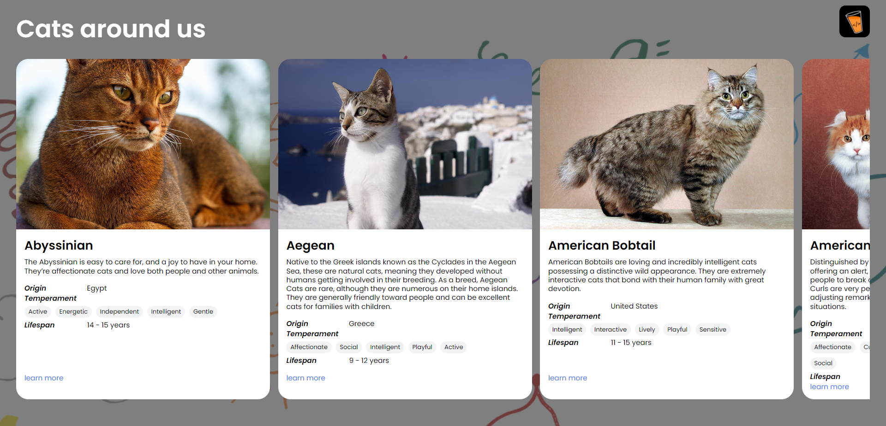

MasterJi Assignment
Machine Coding Round - 2 (React.js)

live link - https://master-ji.vercel.app/

## Assignments Details
## Develop the react components using react and perform api integration

- **random user profile**: Generate information about a random user.
- **random jokes**: Generate a random joke.
- **cats listing**: Displays a horizontal pagination view of different cats listing.

## Technologies Used

- **React.js**: React is the library for web and native user interfaces.
- **Tailwind CSS**: A utility-first CSS framework for styling the application.
- **Axios**: A promise-based HTTP client for making requests to the API.

## Screenshot

